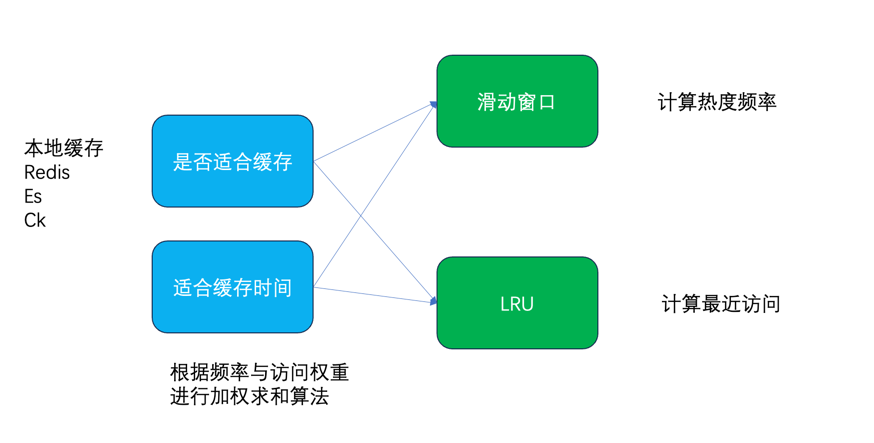
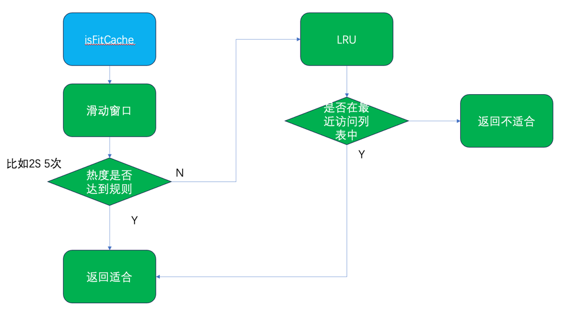
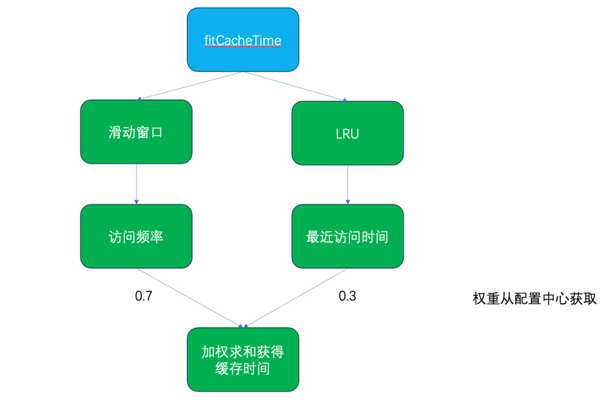

# fit-cache
目前业内对于本地缓存、Redis、Es、Ck等缓存的使用处于比较随意的状态，一方面是资源的浪费，另外一方面如果是本地缓存可能是导致oom的最后一根稻草。
作者创作的fit-cache提供key是否适合缓存，适合缓存的时间，解决缓存滥用、缓存同时失效等问题。
fit-cahe要实现两个功能：key是否适合缓存、如果适合缓存，应该缓存多久。
fit-cahe要实现两个功能：key是否适合缓存、如果适合缓存，应该缓存多久。

作者参考了Mysql的Innodb存储引擎（innodb用有百分比的LRU进行mysql的缓冲池，避免频繁的磁盘读写）和京东的HotKey（京东用于商城的热点数据及时缓存，防止大促下打爆redis）。
作者认为可以使用滑动窗口+LRU列表的方式进行计算，也就是频率和最近访问时间。

实现的话，作者认为频率的权重在最近访问之上因此是否适合缓存应该是先判断key对应的滑动窗口是否达到设定的热度规则，
如果达不到再看LRU列表，但是LRU的长度是需要限定的，不然就不是非常有可能被很快被再次访问。

适合缓存的时间就需要通过频率和最近访问时间分配权重，进行加权计算，最近访问时间还需要进行指数衰减，因为访问时间离现在越久，很明显优先级越低。 
